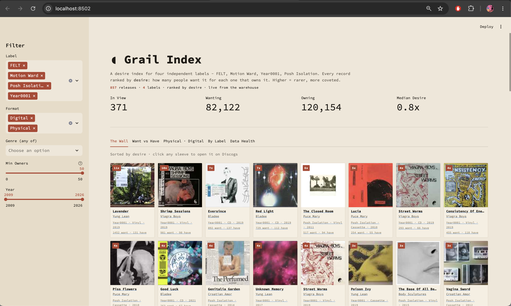

# Discogs Desire Index - a data pipeline

An end-to-end data pipeline that pulls release data from the Discogs API for four
independent record labels, transforms it into a tested star schema, and visualises a
**"desire index"** — which records are most wanted relative to how few people actually
own them (the want-to-have ratio), divided by format, genre, label and year.

For every release, Discogs records how many collectors want it and how many own it. The
ratio between the two says something price alone doesn't: a record wanted by many and
owned by few is genuinely hard to find, whatever it currently sells for.

**Labels covered:** FELT, Motion Ward, Year0001, Posh Isolation
**Scale:** ~1,060 releases ingested, 857 after deduplication

Built for course 7: Data Engineering, at Hyper Island's Data Analyst Program (DA27) by Daniel Ellow
## Pipeline flow



```
Discogs API
   │   ingest_discogs.py   (Python: paginated, rate-limit aware, resilient to errors)
   ▼
Raw JSON               raw/discogs/releases/ingest_date=YYYY-MM-DD/*.jsonl   (immutable, date-partitioned)
   │   load_to_duckdb.py
   ▼
DuckDB  (bronze)       raw.releases_raw   — release JSON stored as-is
   │   dbt  (staging → intermediate → marts)
   ▼
DuckDB  (gold)         star schema: fct_release + dim_artist / dim_label / dim_genre /
   │                   dim_date / dim_format, plus bridge_release_genre
   ▼
Streamlit app          a browsable "wall" of releases, querying the gold layer live

         orchestrated end-to-end by a scheduled GitHub Actions workflow
         (.github/workflows/pipeline.yml — daily cron + manual trigger)
```

## Tools per stage

| Stage | Tool |
|---|---|
| Source | Discogs REST API |
| Ingestion | Python (`requests`) |
| Raw storage | Date-partitioned JSON → DuckDB bronze table |
| Warehouse | DuckDB |
| Transformation | dbt (Core + dbt-duckdb) |
| Visualization | Streamlit (queries the warehouse directly, no CSV export) |
| Orchestration | GitHub Actions (scheduled) |

## Medallion architecture, documentation & tests

- **Bronze:** `raw.releases_raw` — raw API responses, untouched.
- **Silver:** `stg_releases` (flatten/type) → `int_releases_cleaned` (dedupe, clean, derive
  the want-to-have ratio).
- **Gold:** `fct_release` (grain: one release) + conformed dimensions.
- **Documentation & tests:** `discogs_dbt/models/marts/_marts.yml` — table/column
  descriptions plus `unique`, `not_null` and `relationships` tests (22 models + tests pass).

## Design decisions

Fuller reasoning, including the alternatives considered, is in [`decision_log.md`](decision_log.md).

**DuckDB instead of a cloud warehouse.** The dataset fits comfortably on one machine, and
DuckDB removes the cost, credentials and cross-cloud setup a hosted warehouse would need.
Because the transformations are written in dbt, moving to Snowflake or BigQuery later means
changing the connection profile rather than rewriting the models.

**GitHub Actions instead of Airflow.** One sequential job on a daily schedule doesn't justify
running an orchestrator. Actions needs no infrastructure and is already attached to the
repository. The tradeoff is best-effort timing: scheduled runs can start late when GitHub is
busy, which doesn't matter for a daily refresh.

**The live API instead of Discogs' bulk data dumps.** The dumps are easier to process but are
published monthly, so want and have counts would always lag. Calling the API keeps the numbers
current; the cost is rate limiting, which the ingestion script paces its requests around.

**One sequential job rather than decoupled ingestion and transformation.** At this scale,
splitting them would add failure modes without buying anything. If the catalogue grew or more
labels were added, decoupling would be the first change to make.

**Immutable, date-partitioned raw files.** Ingestion never overwrites: each run writes to its
own `ingest_date=` partition. That makes the bronze layer replayable, so a transformation bug
can be fixed and rebuilt without going back to the API.

## Running it locally

```bash
pip install requests python-dotenv duckdb dbt-duckdb streamlit
# create a .env file with:  DISCOGS_TOKEN=your_token

python ingest_discogs.py                      # pull from the API → raw JSON
python load_to_duckdb.py                       # load raw JSON → DuckDB bronze
cd discogs_dbt && dbt build --profiles-dir .   # transform + test → star schema
cd .. && streamlit run app.py                  # explore the desire index
```

You'll need a free Discogs account to generate a personal access token.

Two helper scripts sit alongside the pipeline: `scout_labels.py` for finding label IDs on
Discogs, and `test_discogs.py` for checking that the API connection and token work.

## Repository structure

```
.
├── ingest_discogs.py          # ingestion
├── load_to_duckdb.py          # raw → bronze
├── app.py                     # Streamlit visualization
├── discogs_dbt/               # dbt project (models, tests, docs)
├── .github/workflows/         # scheduled pipeline (GitHub Actions)
├── decision_log.md            # design decisions & trade-offs
└── (gitignored: .env, discogs.duckdb, raw/)
```
## Limitations and what's next

- The want-to-have ratio measures scarcity relative to demand, not price. A high ratio means a
  record is hard to find, not that it sells for a lot.
- The four labels were chosen by interest rather than sampled, so the index describes these
  catalogues and doesn't generalise to the wider market.
- Deduplication matches on release metadata, which misses some reissues and regional variants.
- Want and have counts are a snapshot at ingestion time. Tracking how the ratio moves would say
  more than its current value does.
- Next steps: more labels, a time series of the ratio, and a comparison against marketplace prices.

